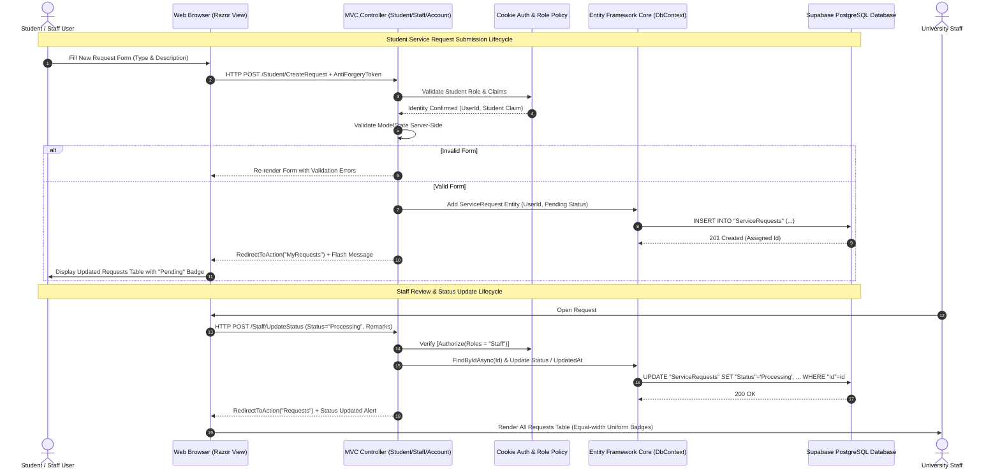

# Student Service Request System — Project Report & Documentation
**Course Assignment / Capstone Project**  
*Developed for University Student Service Administration*  
*Technology Stack: ASP.NET Core 8 MVC, Entity Framework Core, Supabase PostgreSQL, Bootstrap 5*

---

## Table of Contents
1. [Part A — Problem Analysis](#part-a--problem-analysis)
   - [1. System Stakeholders](#1-system-stakeholders)
   - [2. Major Functional Requirements (FR)](#2-major-functional-requirements-fr)
   - [3. Major Non-Functional Requirements (NFR)](#3-major-non-functional-requirements-nfr)
   - [4. Conflict Between Ease of Use and Access Control/Security](#4-conflict-between-ease-of-use-and-access-controlsecurity)
   - [5. Influence of Conflict on System Design](#5-influence-of-conflict-on-system-design)
2. [Part B — System Design](#part-b--system-design)
   - [1. Domain Models](#1-domain-models)
   - [2. ViewModels](#2-viewmodels)
   - [3. Controllers & Action Methods](#3-controllers--action-methods)
   - [4. Razor Views & Navigation Architecture](#4-razor-views--navigation-architecture)
   - [5. Database Schema & Relational Structure](#5-database-schema--relational-structure)
   - [6. Architecture Flow Diagram (User → View → Controller → Model/DB)](#6-architecture-flow-diagram)
   - [7. Design Structure Justification](#7-design-structure-justification)
3. [Part C — Implementation & Feature Verification Checklist](#part-c--implementation--feature-verification-checklist)

---

# Part A — Problem Analysis

### 1. System Stakeholders

The primary stakeholders involved in the university service request ecosystem include:

| Stakeholder | Role & Responsibility in the System |
| :--- | :--- |
| **Students** | Primary end-users who apply for university documents and services (e.g., ID card replacements, academic transcripts, certificates), track application progress in real-time, and view administrative remarks. |
| **University Staff / Administrative Officers** | Authorized personnel responsible for logging into the administrative portal, reviewing submitted requests, verifying academic eligibility, changing request statuses (`Pending` $\rightarrow$ `Processing` $\rightarrow$ `Completed` / `Rejected`), and appending official feedback. |
| **University IT / System Administrators** | Ensure system uptime, secure cloud database connectivity (Supabase PostgreSQL), audit logs, and account access integrity. |
| **University Management** | Benefit from reduced administrative paperwork, eliminated manual queues, and automated operational reporting. |

---

### 2. Major Functional Requirements (FR)

- **FR1: Student Account Management & Authentication**
  - Students must be able to register an account with their Full Name, University Email, and Password.
  - Students must be able to securely login and logout via session-based cookie authentication.
- **FR2: Service Request Submission**
  - Authenticated students must be able to submit a new service request.
  - Students must select one of the university standard request types:
    - *ID Card Replacement*
    - *Transcript Request*
    - *Certificate Request*
  - Students must provide a descriptive explanation of their request purpose.
- **FR3: Student Tracking & History**
  - Students must have access to a dedicated dashboard summarizing total submissions and request states.
  - Students must be able to view their complete request history with submission dates, status badges, and staff remarks.
  - Students must be able to view a detailed breakdown of individual requests.
- **FR4: Staff Administrative Portal & Centralized Overview**
  - University staff must be able to log in through the unified portal.
  - Staff must have a KPI dashboard displaying metrics (Total Requests, Pending Review, Processing, Completed, Rejected).
  - Staff must be able to view all student requests across the entire university.
- **FR5: Administrative Filtering & Search**
  - Staff must be able to filter submissions by Status (`All`, `Pending`, `Processing`, `Completed`, `Rejected`), by Request Type, or search by Student Name / Email / Request ID.
- **FR6: Status & Feedback Management**
  - Staff must be able to view complete details of any submission.
  - Staff must be able to update the status to `Pending`, `Processing`, `Completed`, or `Rejected` and supply official administrative remarks.

---

### 3. Major Non-Functional Requirements (NFR)

- **NFR1: Security & Access Control**
  - Passwords must never be stored in plain text. Secure cryptographic hashing (PBKDF2 with SHA-256 and unique 16-byte cryptographic salt) must be enforced.
  - Role-Based Access Control (RBAC) must strictly segregate Student and Staff capabilities (`[Authorize(Roles = "Student")]`, `[Authorize(Roles = "Staff")]`).
  - Insecure Direct Object References (IDOR) must be prevented: students must never be allowed to view or alter another student's request details.
  - Anti-forgery tokens (`@Html.AntiForgeryToken()`) must protect all HTTP POST forms against Cross-Site Request Forgery (CSRF).
- **NFR2: Usability & User Experience (UX)**
  - Clean, modern, responsive interface using Bootstrap 5 and custom CSS.
  - Color-coded, uniform status pill badges (`Pending` = Yellow, `Processing` = Blue, `Completed` = Green, `Rejected` = Red) for effortless scanning.
  - Informative validation error messages both client-side and server-side.
- **NFR3: Reliability & ACID Compliance**
  - Persisted in an enterprise PostgreSQL cloud database (Supabase) via Entity Framework Core.
  - Foreign key constraints ensure relational referential integrity.
- **NFR4: Performance & Maintainability**
  - Asynchronous database querying (`async/await`) ensures thread-pool scalability under high concurrent student traffic.
  - Strict Model-View-Controller (MVC) separation of concerns ensures easy code maintenance and future feature extensibility.

---

### 4. Conflict Between Ease of Use and Access Control/Security

In public-facing web systems, **Usability** and **Security** frequently pull in opposing directions:

1. **Simplicity vs. Strict Verification**:
   - Students desire instant, frictionless submission with zero bureaucratic delays.
   - Security requires authenticated identity, role verification, and session timeouts to safeguard private academic records.
2. **Data Exposure vs. Transparent Tracking**:
   - Making status tracking effortless could inadvertently expose sensitive student data (academic transcripts, personal ID data) if URLs like `/Student/Details/12` can be arbitrarily viewed by any logged-in student (IDOR attack).
3. **Open Self-Service vs. Privilege Escalation**:
   - Allowing students to freely register accounts online creates a risk where malicious users might attempt to assign themselves the "Staff" role to manipulate administrative statuses.

---

### 5. Influence of Conflict on System Design

To resolve this conflict without sacrificing usability or security, the system architecture implements a **"Frictionless Surface, Ironclad Backend"** strategy:

1. **Streamlined, Low-Friction Student Experience**:
   - Public registration asks only for essential fields (Name, Email, Password). The system **hardcodes the Student role** upon registration, eliminating administrative bottlenecks while preventing privilege escalation.
   - The submission form requires only two intuitive inputs: a dropdown for Request Type and a clear text area for Description. The student's ID and Name are automatically extracted from the authenticated claims, eliminating redundant form filling.
2. **Zero-Trust Backend Access Control**:
   - Controllers are partitioned with declarative ASP.NET Core authorization filters:
     - `StudentController` $\rightarrow$ `[Authorize(Roles = "Student")]`
     - `StaffController` $\rightarrow$ `[Authorize(Roles = "Staff")]`
   - **Programmatic Ownership Enforcement (Anti-IDOR)**: In `StudentController.Details(int id)`, the system queries the request filtering by *both* `Id == id` AND `UserId == currentLoggedInStudentId`. If an unauthorized student tries to peek at someone else's ID, an `AccessDenied` or `NotFound` is safely returned.
   - **Visual Feedback over Cryptic Errors**: When unauthorized access is blocked, a friendly, styled `AccessDenied.cshtml` view guides the user back to safety rather than throwing harsh 403 server error pages.

---

# Part B — System Design

### 1. Domain Models
Located in the `Models/` folder:
- **`User`**: Represents system users (Students and Staff).
  - Properties: `Id` (PK), `Name`, `Email`, `PasswordHash`, `Role` (`Student` / `Staff`), `CreatedAt`.
- **`ServiceRequest`**: Represents a student's service application.
  - Properties: `Id` (PK), `UserId` (FK to `User`), `RequestType` (Enum), `Description`, `Status` (Enum), `StaffRemarks`, `RequestDate`, `UpdatedAt`.
- **`UserRole`** (Enum): `Student`, `Staff`.
- **`RequestType`** (Enum): `IDCardReplacement`, `TranscriptRequest`, `CertificateRequest`.
- **`RequestStatus`** (Enum): `Pending`, `Processing`, `Completed`, `Rejected`.

### 2. ViewModels
Located in the `ViewModels/` folder for strict separation between DB entities and UI forms:
- `RegisterViewModel`: Name, Email, Password, ConfirmPassword with DataAnnotations.
- `LoginViewModel`: Email, Password, ReturnUrl.
- `CreateServiceRequestViewModel`: RequestType, Description with max length and required attributes.
- `StudentDashboardViewModel`: Total, Pending, Processing, Completed, Rejected counts, Recent Requests.
- `StaffDashboardViewModel`: Global university metrics and recent submissions.
- `StaffRequestsFilterViewModel`: Search term, Status filter, Type filter, Paginated/Filtered request list.
- `UpdateStatusViewModel`: RequestId, StudentName, RequestType, CurrentStatus, NewStatus, StaffRemarks.
- `RequestDetailsViewModel`: Comprehensive request summary with student contact info.

### 3. Controllers & Action Methods
- **`AccountController`**:
  - `GET /Account/Login` & `POST /Account/Login` (Cookie claims sign-in)
  - `GET /Account/Register` & `POST /Account/Register` (New student registration)
  - `POST /Account/Logout` (Sign-out & clear session)
  - `GET /Account/AccessDenied` (Forbidden view)
- **`StudentController`** (`[Authorize(Roles = "Student")]`):
  - `GET /Student/Dashboard` (KPI stats, submission shortcuts)
  - `GET /Student/CreateRequest` & `POST /Student/CreateRequest` (Form handling & DB insertion)
  - `GET /Student/MyRequests` (Personal request history & status filter)
  - `GET /Student/Details/{id}` (Ownership-guarded detail view)
- **`StaffController`** (`[Authorize(Roles = "Staff")]`):
  - `GET /Staff/Dashboard` (University-wide KPI counters & urgent pending list)
  - `GET /Staff/Requests` (Comprehensive table with multi-filter criteria)
  - `GET /Staff/Details/{id}` (Full view of any request)
  - `GET /Staff/UpdateStatus/{id}` & `POST /Staff/UpdateStatus` (Status transition & remark entry)
- **`HomeController`**:
  - `GET /` (Landing page showcasing university services, login/register shortcuts)
  - `GET /Home/Error` (Centralized error handling)

### 4. Razor Views & Navigation Architecture
- **Shared Layout (`Views/Shared/_Layout.cshtml`)**:
  - Dynamic responsive navbar adapting to authentication state:
    - *Anonymous*: Home, Login, Register.
    - *Student*: Home, Dashboard, Submit Request, My Requests, Logout.
    - *Staff*: Home, Staff Dashboard, All Student Requests, Logout.
- **Global Design System (`wwwroot/css/site.css`)**:
  - Uniform `.status-badge` width (108px) for aligned table presentation.
  - Perfect 1:1 circular icon containers (`.icon-circle`) for dashboard KPIs.
  - Inline action button alignment (`.btn-group .btn { white-space: nowrap !important; }`).

---

### 5. Database Schema & Relational Structure

```
+-------------------------------------------------------------+
|                         USERS                               |
+-------------------------------------------------------------+
| PK  | Id           | integer            | NOT NULL          |
|     | Name         | varchar(100)       | NOT NULL          |
|     | Email        | varchar(150)       | NOT NULL, UNIQUE  |
|     | PasswordHash | varchar(255)       | NOT NULL          |
|     | Role         | varchar(20)        | NOT NULL          |
|     | CreatedAt    | timestamptz        | DEFAULT NOW()     |
+-------------------------------------------------------------+
                              |
                              | 1
                              |
                              | has many
                              |
                              | N
+-------------------------------------------------------------+
|                    SERVICE REQUESTS                         |
+-------------------------------------------------------------+
| PK  | Id           | integer            | NOT NULL          |
| FK  | UserId       | integer            | References Users  |
|     | RequestType  | varchar(50)        | NOT NULL          |
|     | Description  | varchar(1000)      | NOT NULL          |
|     | Status       | varchar(20)        | NOT NULL          |
|     | StaffRemarks | text               | NULLABLE          |
|     | RequestDate  | timestamptz        | DEFAULT NOW()     |
|     | UpdatedAt    | timestamptz        | NULLABLE          |
+-------------------------------------------------------------+
```

---

### 6. Architecture Flow Diagram



---

### 7. Design Structure Justification

1. **Why ASP.NET Core MVC?**
   - The MVC architectural pattern cleanly isolates Business Logic (`Models`), User Interface Presentation (`Views`), and Request Routing/Orchestration (`Controllers`). This structure ensures code testability, high maintainability, and clean separation of concerns.
2. **Why ViewModels instead of passing Domain Entities directly?**
   - Direct entity binding exposes applications to Mass Assignment / Over-Posting vulnerabilities (e.g., an attacker injecting a modified `UserId` or altering `Status` during submission). ViewModels ensure only permitted fields are exposed to and accepted from the browser.
3. **Why Supabase PostgreSQL with Entity Framework Core?**
   - EF Core provides type-safe LINQ queries, automatic migrations, and built-in SQL injection prevention via parameterized queries. Supabase provides a high-performance, cloud-hosted, ACID-compliant relational PostgreSQL database accessible anywhere with SSL encryption.

---

# Part C — Implementation & Feature Verification Checklist

| Requirement | Implementation Component in Codebase | Status |
| :--- | :--- | :---: |
| **Student Registration** | `AccountController.cs` (`Register`), `Register.cshtml`, `RegisterViewModel` | ✅ Tested & Working |
| **Student Login** | `AccountController.cs` (`Login`), `Login.cshtml`, Cookie Auth | ✅ Tested & Working |
| **Submit Service Request** | `StudentController.cs` (`CreateRequest`), `CreateRequest.cshtml` | ✅ Tested & Working |
| **Request Types (ID, Transcript, Cert)** | `RequestType.cs` (`IDCardReplacement`, `TranscriptRequest`, `CertificateRequest`) | ✅ Tested & Working |
| **Short Description** | `ServiceRequest.Description` with `[Required]`, `[StringLength(1000)]` | ✅ Tested & Working |
| **View Submitted Requests** | `StudentController.cs` (`MyRequests`), `MyRequests.cshtml` | ✅ Tested & Working |
| **Track Status of Requests** | `Status` column with `.status-badge` in `Dashboard.cshtml` & `MyRequests.cshtml` | ✅ Tested & Working |
| **Staff Login** | `AccountController.cs` (`Login`), Seeds: `admin@university.com` / `Admin@123456` | ✅ Tested & Working |
| **View Submitted Requests (Staff)** | `StaffController.cs` (`Requests`), `Requests.cshtml` (Search & Status/Type filters) | ✅ Tested & Working |
| **View Request Details (Staff)** | `StaffController.cs` (`Details`), `Views/Staff/Details.cshtml` | ✅ Tested & Working |
| **Change Status (Pending/Processing/Completed/Rejected)** | `StaffController.cs` (`UpdateStatus`), `Views/Staff/UpdateStatus.cshtml` | ✅ Tested & Working |
| **Server-Side Validation** | DataAnnotations on ViewModels, `ModelState.IsValid` checks in all POST actions | ✅ Tested & Working |
| **Database Connectivity** | `ApplicationDbContext.cs`, Npgsql PostgreSQL provider, Supabase Cloud DB | ✅ Tested & Working |
| **Role-Based Authorization** | `[Authorize(Roles = "Student")]`, `[Authorize(Roles = "Staff")]`, `AccessDenied.cshtml` | ✅ Tested & Working |
| **IDOR Ownership Protection** | `StudentController.cs` (`Details`) checks `request.UserId == currentUserId` | ✅ Tested & Working |
| **Uniform UI & Circles** | `.status-badge` (108px equal width), `.icon-circle` (1:1 perfect circles) | ✅ Tested & Working |
